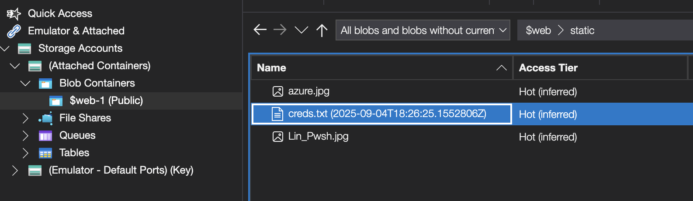

# Blitz CTF 2025 (Official Writeups)

These are the official writeups for the challenges I created for the Blitz CTF... forensics and misc :>

## Not Crypto (Misc)

> It can't be in the crypto category... everything is there for you to grab. Also don't try brute forcing&#x20;
>
> File link: [https://drive.google.com/file/d/1NH\_rCjNcHHgcA5EJhJoA5X3dsepBLW5s/view?usp=sharing](https://drive.google.com/file/d/1NH_rCjNcHHgcA5EJhJoA5X3dsepBLW5s/view?usp=sharing)

Sadly, this challenge remained unsolved till the end as I believe most people were spending time on trying to find an exploit in the cryptography part. That was the reason I kept the challenge **Not Crypto**.&#x20;

To solve this challenge the first step could be figured out from the fact that you are provided with a `.pyc` file instead of a normal `.py` file. Usually in this case you should think of something related to steganography, the password used to encrypt data was unknown so probably that was hidden. By doing some digging you come across:



Simply running the extraction command reveals the hidden password:

```bash
./stegosaurus encrypt.cpython-36.pyc -x

Output:
Extracted payload: whoevenputsthepasswordhereandwhyisitsooooooLONG?
```

To figure out the encryption used you can use [https://github.com/rocky/python-uncompyle6](https://github.com/rocky/python-uncompyle6) to uncompile the `.pyc` file and get the orginal code. Then with basic crypto knowledge or even ChatGPT write the decryption script. On decryption you get the flag:

```
Blitz{h0ly_whY_w0uLd_u_puT_tH3_p4ssw0rd_th3re?}
```

## Diff n' Rae

> I love to use GitHub especially because of the compare feature. psst...do star my hide-secrets GitHub repo if you like it 🙂
>
> File link: [https://drive.google.com/file/d/1Fn6CVu0k1JXbI4qo4eDuIM7ThimopX8I/view?usp=sharing](https://drive.google.com/file/d/1Fn6CVu0k1JXbI4qo4eDuIM7ThimopX8I/view?usp=sharing)

The name and GitHub compare hints towards the **diff** tool in Linux. Reading other writeups some even used XOR to solve it which basically works in the same way only.

To solve we have to take diff of the strings of both the images. Running the following commands:

```bash
strings -n 1 img1.jpg > 1.txt
strings -n 1 img2.jpg > 2.txt
diff img1.jpg img2.jpg

Output:
3d2
< Qmx
8c7
< )
---
> pdHp7)
10c9
< ZDFm
---
> Rl8x
77d75
< U1
949a948
>       91N
4707d4705
< TNm
4770a4769
> dUx9
```

By reconstructing the base64 payload from the output we get `QmxpdHp7ZDFmRl8xU191NTNmdUx9` which decodes and gives us the flag as:

```
Blitz{d1fF_1S_u53fuL}
```

## F0xCrumb

> Don't keep the jar of cookies in the open...
>
> File link: [https://drive.google.com/file/d/1oLiJ9NQH9UFv-W1iFvlXbUB4k-0X8e7L/view?usp=sharing](https://drive.google.com/file/d/1oLiJ9NQH9UFv-W1iFvlXbUB4k-0X8e7L/view?usp=sharing)

This was a relatively easy forensics challenge. The name hints towards **Firefox** and the description has the word **cookies**, indicating that we have to find a certain cookie in the Firefox browser.

Let's start by analysing the memory dump that we have, it can be easily done using volatility3 and running the following command:

```bash
vol -f firefoxchall windows.info
```

<figure><figcaption></figcaption></figure>

On a windows machine we know that user data of Firefox would be stored in `\AppData\Roaming\Mozilla\Firefox\Profiles\` . We use the following  command to find it:

```bash
vol -f firefoxchall windows.filescan | grep -i "firefox"
```

We find the exact location of the sqlite file storing the cookies:

```bash
0xe1811368d590  \Users\jennie\AppData\Roaming\Mozilla\Firefox\Profiles\qxjsnlmd.default-release\cookies.sqlite
```

Now we have to dump this file which can be done by specifying the virtual address we found:

```bash
vol -f firefoxchall windows.dump --virtaddr 0xe1811368d590
```

Using any sqlite viewer we can then explore the cookie table, I used **sqlite3** and got this output:


```
1||totallynormalcookie|QmxpdHp7ZjFyM2YweF81aDB1bGRfM25jcnlwdF9jMDBrMTM1fQo%3D|military-candle-elephant.glitch.me|/|1742710132|1742623732174000|1742623723377000|0|1|0|1|0|2|0
```


The string `QmxpdHp7ZjFyM2YweF81aDB1bGRfM25jcnlwdF9jMDBrMTM1fQo` stands out and base64 decoding it gives us the flag:

```
Blitz{f1r3f0x_5h0uld_3ncrypt_c00k135}
```

