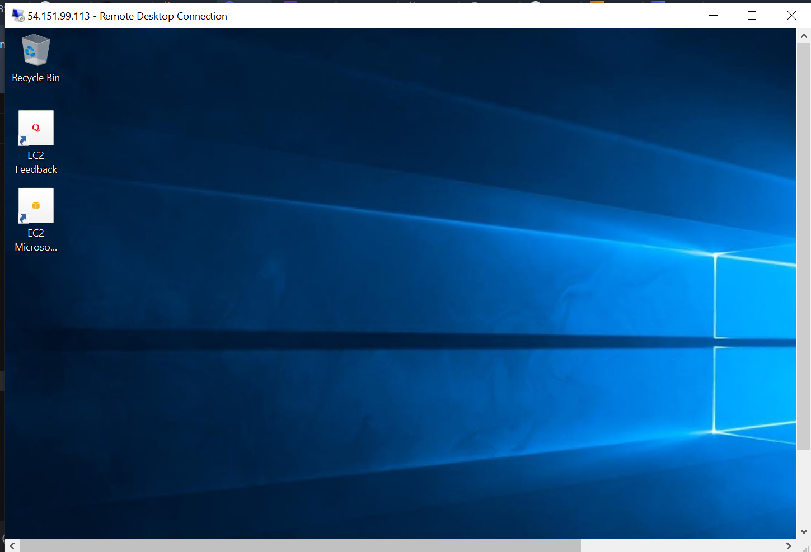
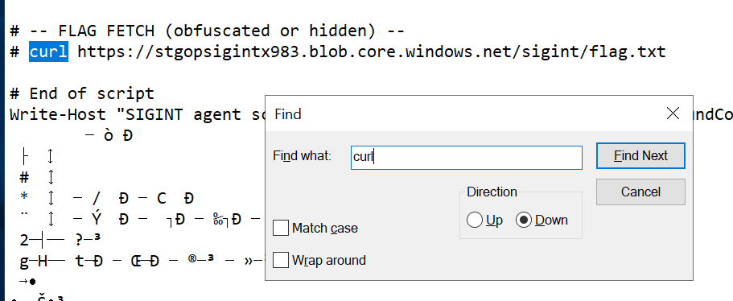

# THE AMI (BSides Mumbai 2025)

The objective of this challenge was to exploit a public AMI (amazon machine image) and then try to access the flag. We were provided with the image id `07cc411e2ef775215` and a password `CloudCTF2025!`&#x20;

### 1. Identify the region

As the AMIs are region specific we can't directly use the [https://console.aws.amazon.com/ec2](https://console.aws.amazon.com/ec2) to search for this public machine. Instead, we write a script to brute force every region.

```powershell
$id = "ami-07cc411e2ef775215"

$regions = @(
    "us-east-1","us-east-2","us-west-1","us-west-2",
    "ap-south-1","ap-northeast-3","ap-northeast-2","ap-southeast-1",
    "ap-southeast-2","ap-northeast-1","ca-central-1",
    "eu-central-1","eu-west-1","eu-west-2","eu-west-3","eu-south-1"
)

foreach ($r in $regions) {
    Write-Host -NoNewline "Region: $r "
    aws ec2 describe-images --image-ids $id --region $r
}
```

After running the script, we got a hit at `us-west-1`&#x20;

### 2. Connect to the machine

As we were unable to connect to the snapshot ID of the image we decided to directly launch an instance and then RDP (Remote Desktop Connection) into that.

```bash
aws ec2 run-instances --image-id ami-07cc411e2ef775215 \
--instance-type t2.micro --region us-west-1
```

By default, RDP is not allowed to we first have to allow that on this machine, it can be easily done by running the following command:

```bash
aws ec2 authorize-security-group-ingress \
--group-id sg-0733b3f9680a1f3fc \
--protocol tcp --port 3389 --cidr 0.0.0.0/0 \
--region us-west-1
```

We then obtain the public IP of the machine by running the following command:

```bash
aws ec2 describe-instances   --instance-ids i-050dddf785a63d8d5   --query "Reservations[*].Instances[*].PublicIpAddress"   --region us-west-1
```

Which gives `54.151.99.113` as the public IP to connect to. Using the username: `Administrator` and password: `CloudCTF2025!` we are successfully able to connect.

<figure><figcaption></figcaption></figure>

### 3. Finding the flag

We explore the machine and in the Downloads folder find a sus file called `agent.exe` . On opening the file with Notepad we discover a hidden curl command which gives us our flag.

<figure><figcaption></figcaption></figure>

Running `curl https://stgopsigintx983.blob.core.windows.net/sigint/flag.txt`  gives the flag as:

```
BMCTF{4M1'5_4R3_N0T_S3CUR3}
```

_Correction, public AMS are not secure_ :sob:_... pls don't use them!_
